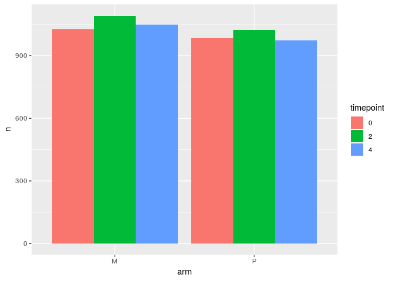
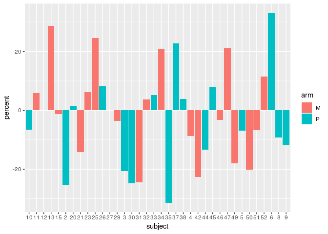
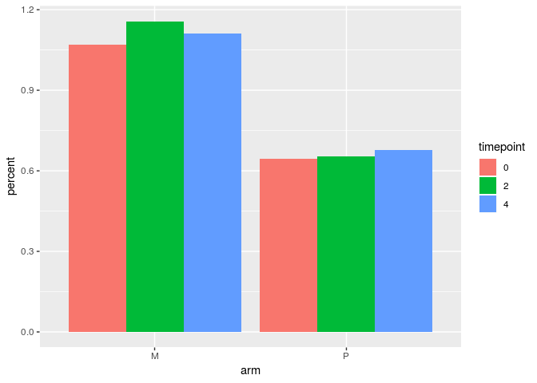

Final task Virome report
================
Just a Team
2019-03-29

## Including libraries

``` r
# install.packages("tidyverse")
# install.packages("lubridate")
# install.packages("here")

library(tidyverse)
```

    ## ── Attaching packages ─────────────────────────────────────────────────────────────────────────────── tidyverse 1.2.1 ──

    ## ✔ ggplot2 3.1.0       ✔ purrr   0.3.0  
    ## ✔ tibble  2.0.1       ✔ dplyr   0.8.0.1
    ## ✔ tidyr   0.8.2       ✔ stringr 1.4.0  
    ## ✔ readr   1.3.1       ✔ forcats 0.4.0

    ## ── Conflicts ────────────────────────────────────────────────────────────────────────────────── tidyverse_conflicts() ──
    ## ✖ dplyr::filter() masks stats::filter()
    ## ✖ dplyr::lag()    masks stats::lag()

``` r
library(lubridate)
```

    ## 
    ## Attaching package: 'lubridate'

    ## The following object is masked from 'package:base':
    ## 
    ##     date

``` r
library(here)
```

    ## here() starts at /cloud/project

    ## 
    ## Attaching package: 'here'

    ## The following object is masked from 'package:lubridate':
    ## 
    ##     here

## Reading csv’s

``` r
phage_counts <- read_csv(here("data", "phage_counts.csv"))
```

    ## Parsed with column specification:
    ## cols(
    ##   subject = col_double(),
    ##   arm = col_character(),
    ##   timepoint = col_double(),
    ##   query = col_character(),
    ##   tax_id = col_double(),
    ##   parent_tax_id = col_double()
    ## )

``` r
library_size <- read_csv(here("data", "library_size.csv"))
```

    ## Parsed with column specification:
    ## cols(
    ##   subject = col_double(),
    ##   timepoint = col_double(),
    ##   read_count = col_double()
    ## )

``` r
phage_counts
```

    ## # A tibble: 151,065 x 6
    ##    subject arm   timepoint query               tax_id parent_tax_id
    ##      <dbl> <chr>     <dbl> <chr>                <dbl>         <dbl>
    ##  1      10 P             0 SRR5580239.1195243   38018         12333
    ##  2      10 P             0 SRR5580237.5787515  754039        196896
    ##  3      10 P             0 SRR5580233.2454247 1401669        196894
    ##  4      10 P             0 SRR5580236.759656  1555202        196896
    ##  5      10 P             0 SRR5580238.2213536  571950         12333
    ##  6      10 P             0 SRR5580236.979355  1289598       1758253
    ##  7      10 P             0 SRR5580237.6405085 1084719        686598
    ##  8      10 P             0 SRR5580237.8850639   38018         12333
    ##  9      10 P             0 SRR5580233.2634354   38018         12333
    ## 10      10 P             0 SRR5580237.5364855  879630        329380
    ## # … with 151,055 more rows

``` r
library_size
```

    ## # A tibble: 118 x 3
    ##    subject timepoint read_count
    ##      <dbl>     <dbl>      <dbl>
    ##  1      10         0   15583005
    ##  2      10         2   15354487
    ##  3      10         4   15453835
    ##  4      11         0   12510331
    ##  5      11         2   13760572
    ##  6      11         4   13065700
    ##  7      12         0   13119084
    ##  8      12         2   15294197
    ##  9      12         4   10398890
    ## 10      13         0   15085520
    ## # … with 108 more rows

``` r
table1 <- phage_counts %>%
            group_by( arm, timepoint) %>%
            count(tax_id) %>% 
            summarize(n = n())
```

``` r
table1 <- table1 %>% transform(timepoint=as.character(timepoint))
ggplot(table1, aes(x=arm, y=n, fill=timepoint)) + geom_bar(position="dodge", stat="identity")
```

<!-- -->

``` r
phage_counts <- phage_counts %>% mutate(subject=as.character(subject))


table2 <- phage_counts %>%
  group_by(arm, subject, timepoint) %>%
  count(tax_id) %>%
    summarise(n = n())
table8 <- table2 %>% 
    spread(timepoint, n) %>% 
    rename_at(c("0","2","4"), ~str_c("tp_", .x)) %>% mutate(percent = (tp_4 - tp_0) / tp_4 * 100)

ggplot(table8, aes(x=subject, y=percent, fill=arm)) + geom_bar(stat='identity') + labs(x='subject')
```

<!-- -->

``` r
table5 <- phage_counts %>%
  group_by(arm, subject, timepoint) %>%
  count(parent_tax_id) %>%
    summarise(n = n())
table5
```

    ## # A tibble: 108 x 4
    ## # Groups:   arm, subject [36]
    ##    arm   subject timepoint     n
    ##    <chr> <chr>       <dbl> <int>
    ##  1 M     11              0   133
    ##  2 M     11              2   134
    ##  3 M     11              4   141
    ##  4 M     12              0    81
    ##  5 M     12              2   104
    ##  6 M     12              4    87
    ##  7 M     13              0    65
    ##  8 M     13              2    98
    ##  9 M     13              4   102
    ## 10 M     15              0    87
    ## # … with 98 more rows

``` r
table3 <- phage_counts %>%
            group_by(subject, arm, timepoint) %>%
            count(query) %>% 
            summarize(n = n())

table3 <- table3 %>% merge(library_size) %>% mutate(percent=(n/(read_count*0.02)*100))

ggplot(table3 %>% mutate(timepoint=as.character(timepoint)), aes(x=arm, y=percent, fill=timepoint)) + 
    geom_bar(position="dodge", stat="identity")
```

<!-- -->
